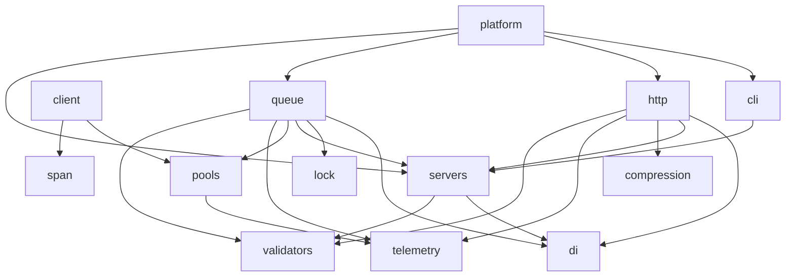

# Utopia Monorepo

The source of truth for the [utopia-php](https://github.com/utopia-php) libraries. Development happens here; each library is distributed to its own read-only repository (e.g. `utopia-php/http`) by subtree split, so Composer/Packagist distribution is unchanged.

## Layout

```
packages/<name>/   one Composer library, mirrored to github.com/utopia-php/<name>
bin/monorepo       all monorepo tooling (dependency-free PHP, built on git subtree)
pint.json          canonical code style for every package
composer.json      pins the shared toolchain (pint, phpstan, rector, phpunit)
```

Code style is monorepo-wide; phpstan levels and rector rules stay per-package
(`phpstan.neon`, `rector.php`) since they encode per-library decisions.

## Dependency graph

Arrows point at dependencies (`platform --> http` means platform requires http). Regenerate with `bin/monorepo graph` after changing a package's requirements — `bin/monorepo validate` (which CI runs on every push) fails while it is stale.

<!-- graph -->

<!-- /graph -->

## Commands

```sh
bin/monorepo list                  # packages and their latest release tag
bin/monorepo absorb <name>         # run the absorption playbook (import + strip QA + mirror lockdown)
bin/monorepo import <name>         # bring an existing library in, preserving full history
bin/monorepo validate              # check package conventions
bin/monorepo check [name...]       # run pint, phpstan and rector (--fix to apply)
bin/monorepo test [name...]        # run package test suites
bin/monorepo split [name...]       # push subtrees to the distribution repositories (CI does this)
bin/monorepo graph                 # regenerate the dependency graph above
```

## Testing

Every package follows the same two-tier contract:

- **`composer test`** — unit tier. Runs on a bare host: no services, no docker. Always runs in CI for changed packages.
- **`composer test:e2e`** (optional) — integration tier. Runs on the host against the package's `docker-compose.yml` services: off-the-shelf or package-built images with healthchecks, published on offset host ports (e.g. 16379, not 6379) so they never collide with a developer's running stacks. Fixtures that need long-running processes (queue workers, app servers) start them on the host — see `packages/queue/tests/e2e.sh`.

`bin/monorepo test <name>` runs both tiers: `composer test`, then — when `test:e2e` is defined — `docker compose up --wait`, `composer test:e2e`, teardown. Tests never run inside containers; containers are only servers the tests talk to.

**Linked runs.** By default siblings resolve from Packagist at released versions — what consumers actually install. `bin/monorepo test <name> --linked` resolves monorepo siblings from the local checkout instead (a generated `composer.linked.json` adds a path repository claiming constraint-satisfying versions). In CI, dependents of a changed package run linked, so a change to `http` runs `platform`'s tests against the new `http` before merge; the changed package itself runs registry-resolved. The two modes answer different questions: linked catches "this change breaks dependents" pre-merge, registry catches "the released constraint combination doesn't actually install".

## How distribution works

On every push to `main`, CI splits each `packages/<name>` directory into a standalone history and pushes it to `utopia-php/<name>`. Libraries are imported with `git subtree add` (full history preserved); the split itself is computed by `bin/monorepo` — starting from the latest `git-subtree-*` annotation, it re-synthesizes one commit per mainline commit that changed the package, byte-identical to `git subtree split` output but immune to its fatal cache collision when a package is removed and re-imported. Splits are deterministic and push fast-forward on top of each mirror's existing history.

The distribution repositories become read-only mirrors: archive their open PRs, enable branch protection, and point contributors here.

## Releasing

```sh
bin/monorepo release http 2.1.0    # --dry-run to preview the notes first
```

This previews the release notes, tags the monorepo `http/2.1.0`, and pushes the tag. CI then pushes tag `2.1.0` to `utopia-php/http` (Packagist picks it up as usual) and publishes a GitHub release on the mirror whose notes are every monorepo commit that touched `packages/http` since the previous release, with a compare link back to the monorepo. Tagging by hand (`git tag http/2.1.0 && git push origin http/2.1.0`) does the same minus the preview.

## Absorbing a library

One command runs most of the playbook:

```sh
bin/monorepo absorb database
```

It imports the library with full history, strips the QA tooling the monorepo hoists (pint/phpstan/rector/phpunit dependencies, QA scripts and `pint.json`, pointing test scripts at the root `phpunit`, refreshing `composer.lock` if one is committed), writes a `mirror.yml` workflow that closes pull requests opened against the mirror with a redirect here, banners the README, and creates the mirror ruleset (PR-only, no force-push, split app bypassed). Every step is idempotent — re-run it freely.

Then, by hand:

1. `bin/monorepo check <name> --fix` — apply the canonical style; fix whatever phpstan and rector surface.
2. `bin/monorepo test <name>` — and make the package satisfy the test contract (see Testing): unit tier in `composer test`, services tier in `composer test:e2e`.
3. Review `packages/<name>/.github/workflows/` — delete QA-only workflows (pint, phpstan, linters); keep test workflows, they validate the mirror after each split.
4. Commit, push, and confirm the Split run is green. If the mirror push is rejected:
   - `master` default branch — rename first: `gh api -X POST repos/utopia-php/<name>/branches/master/rename -f new_name=main`
   - `protected branch hook declined` — classic branch protection; let the app bypass it:
     `echo '{"bypass_pull_request_allowances":{"apps":["utopia-php-monorepo"]}}' | gh api -X PATCH repos/utopia-php/<name>/branches/main/protection/required_pull_request_reviews --input -`
   - diverged mirror (a commit landed upstream after the import) — re-import, or `bin/monorepo split <name> --force` once.
5. Triage pull requests already open on the mirror (the redirect only covers new ones), then make the library's next release from here.

## CI setup

The `Split` workflow authenticates as a GitHub App with `contents: write`, installed on the `utopia-php` org. In this repository's **Settings → Secrets and variables → Actions**, set:

- variable `SPLIT_APP_ID` — the App ID (or client ID)
- secret `SPLIT_APP_PRIVATE_KEY` — the app's private key (`.pem` contents, generated in the app's settings)

## Cross-package development

Packages declare their dependencies normally (resolved from Packagist), so each mirror keeps working standalone. To develop a package against a local sibling:

```sh
cd packages/http
composer config repositories.local path ../di
composer require utopia-php/di:@dev
```

Revert `composer.json` before committing — `bin/monorepo validate` and CI test against released versions.
