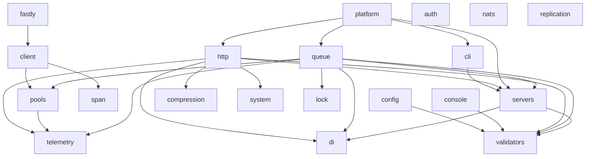

# Utopia Monorepo

The source of truth for the [utopia-php](https://github.com/utopia-php) libraries. Each `packages/<name>` is an independent Composer library; development happens here, and every push is mirrored to its read-only repository (e.g. `utopia-php/http`), so Composer/Packagist distribution is unchanged — mechanics in [docs/distribution.md](docs/distribution.md).

## Quickstart

```sh
git clone git@github.com:utopia-php/monorepo.git && cd monorepo
bin/monorepo test http             # run a package's test suites
bin/monorepo check http --fix      # apply code style, fix what phpstan/rector surface
bin/monorepo validate              # check package conventions (CI enforces this)
```

Edit code under `packages/<name>` and open a pull request here — the mirrors are read-only and redirect PRs back. Cross-package changes are fine in a single commit. Code style is monorepo-wide (`pint.json`), as is the phpstan level-5 floor (the root `phpstan.neon`, enforced for every package). A package adds its own `phpstan.neon` only to raise the level or add settings; rector rules stay per-package (`rector.php`) since they encode per-library decisions.

Run `bin/monorepo` with no arguments for the full command list — `absorb` and `split` are maintainer operations, covered in [docs/absorbing.md](docs/absorbing.md) and [docs/distribution.md](docs/distribution.md). To start a brand-new library, see [docs/creating.md](docs/creating.md).

## Testing

Every package follows the same two-tier contract:

- **`composer test`** — unit tier. Runs on a bare host: no services, no docker. Always runs in CI for changed packages.
- **`composer test:e2e`** (optional) — integration tier. Runs on the host against the package's `docker-compose.yml` services: off-the-shelf or package-built images with healthchecks, published on offset host ports (e.g. 16379, not 6379) so they never collide with a developer's running stacks. Fixtures that need long-running processes (queue workers, app servers) start them on the host — see `packages/queue/tests/e2e.sh`.

`bin/monorepo test <name>` runs both tiers: `composer test`, then — when `test:e2e` is defined — `docker compose up --wait`, `composer test:e2e`, teardown. Tests never run inside containers; containers are only servers the tests talk to.

By default siblings resolve from Packagist at released versions — what consumers actually install. `bin/monorepo test <name> --linked` resolves monorepo siblings from the local checkout instead (a generated `composer.linked.json` adds a path repository claiming constraint-satisfying versions). In CI, dependents of a changed package run linked, so a change to `http` runs `platform`'s tests against the new `http` before merge; the changed package itself runs registry-resolved. The two modes answer different questions: linked catches "this change breaks dependents" pre-merge, registry catches "the released constraint combination doesn't actually install".

## Cross-package development

Packages declare their dependencies normally (resolved from Packagist), so each mirror keeps working standalone. To develop a package against a local sibling:

```sh
cd packages/http
composer config repositories.local path ../di
composer require utopia-php/di:@dev
```

Revert `composer.json` before committing — `bin/monorepo validate` and CI test against released versions.

## Dependency graph

Arrows point at dependencies (`platform --> http` means platform requires http). Regenerate with `bin/monorepo graph` after changing a package's requirements — `bin/monorepo validate` (which CI runs on every push) fails while it is stale.

<!-- graph -->

<!-- /graph -->

## Releasing

```sh
bin/monorepo release http 2.1.0    # --dry-run to preview the notes first
```

This previews the release notes, tags the monorepo `http/2.1.0`, and pushes the tag; CI releases the mirror and Packagist picks it up as usual ([details](docs/distribution.md)). Tagging by hand (`git tag http/2.1.0 && git push origin http/2.1.0`) does the same minus the preview. Never edit a changelog to "release".
